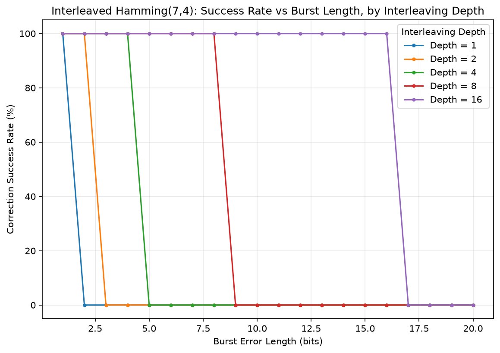
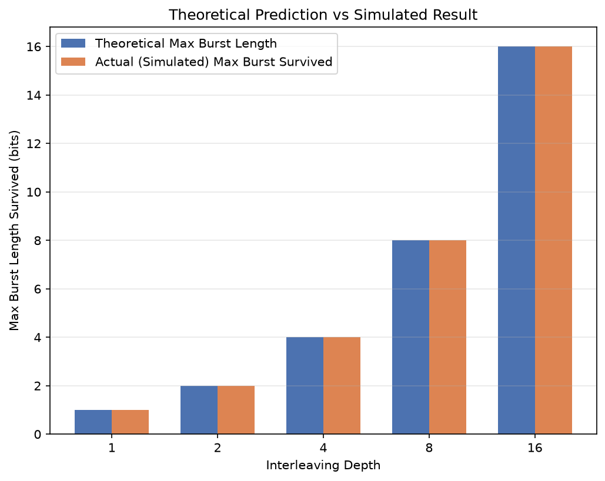
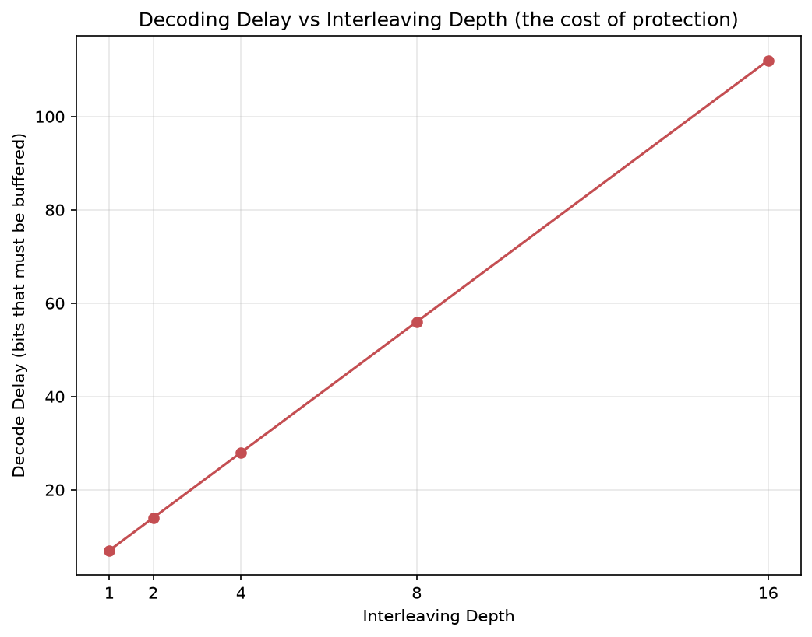

# Empirical Analysis of Interleaving Depth for Burst-Error Correction using Hamming Codes over a Gilbert-Elliott Channel

A Computer Networks course project extending two IEEE papers on interleaved
error-correcting codes from theoretical analysis to empirical, practical
parameter selection.

---

## Problem

Real-world communication channels (wireless links, storage media, satellite
links) don't corrupt data randomly — errors tend to arrive in **bursts**
(a run of several consecutive bad bits), caused by things like fading,
interference, or physical defects. Classical error-correcting codes like
**Hamming(7,4)** can only correct **one bit error per 7-bit block**. A burst
of 2+ consecutive errors landing inside a single block breaks it completely.

**Interleaving** is the classical fix: instead of sending Hamming-encoded
blocks one after another, you weave multiple blocks together bit-by-bit
before transmission. This spreads a burst error thin across many blocks
instead of concentrating it in one, so each block only ever sees at most
one error and can still self-correct.

This project builds and empirically validates an interleaved Hamming(7,4)
system over a simulated bursty channel.

---

## Base Papers

1. **Cideciyan, R., Furrer, S., Lantz, M.**, *"Performance of Interleaved
   Block Codes With Burst Errors,"* IEEE Transactions on Magnetics, 2018.
   Uses a Gilbert-Elliott channel model to derive a mathematical formula
   for codeword-error probability at a *fixed* interleaving depth.

2. **Shin, J. et al.**, *"Burst Error Correction for Convolutional Code
   Concatenated with Hamming Code with a Block Interleaver,"* IEEE
   Conference Publication, 2020. Selects an interleaving depth based on
   channel burst statistics and reports a single BER result for one
   specific configuration.

## The Gap

Both papers analyze interleaved codes **at one chosen depth**, using
mathematical derivation rather than a systematic empirical sweep. Neither
paper answers the practical engineering question:

> *"Given my channel's typical burst length, exactly how much interleaving
> depth do I need — and what does it cost me in decoding delay?"*

This project fills that gap by:
1. Empirically sweeping interleaving depth (1, 2, 4, 8, 16) against burst
   length (1–20 bits) and measuring correction success rate directly via
   simulation, rather than relying solely on closed-form analysis.
2. Validating the simulated results against the theoretical maximum
   survivable burst length (`burst_length ≤ depth`) to confirm the
   simulation matches theory.
3. Providing a practical recommender tool that takes a channel's burst
   statistics and directly outputs the minimum depth needed for a target
   success rate — turning the theory into an actionable decision.

---

## System Design

```
Data bits
  │
  ▼
Hamming(7,4) encode  ──►  4 data bits → 7-bit codeword (can fix 1 bit error/block)
  │
  ▼
Block Interleaver  ──►  weaves `depth` codewords together, column-by-column
  │
  ▼
Bursty Channel  ──►  Gilbert-Elliott model / fixed-length burst injection
  │
  ▼
Block De-interleaver  ──►  reconstructs original codeword order
  │
  ▼
Hamming(7,4) decode  ──►  corrects 1-bit errors per block, recovers data
```

**Gilbert-Elliott channel model:** a 2-state Markov chain (Good/Bad state).
The Good state has a low bit-error probability; the Bad state has a high
one. Transition probabilities between states control how often bursts
occur and how long they last (average burst length ≈ `1 / P(Bad→Good)`).
This is the same channel model used in both base papers, making our
results directly comparable.

---

## Repository Structure

```
cn_project/
├── src/
│   ├── hamming.py          Hamming(7,4) encode/decode
│   ├── channel.py          Gilbert-Elliott channel + fixed burst injection
│   ├── interleaver.py      Block interleaver/de-interleaver
│   ├── pipeline.py         Wires everything into one simulate-a-trial function
│   ├── experiment.py       Runs the full depth x burst-length sweep, saves CSV
│   ├── plot_results.py     Generates all graphs from the results CSV
│   └── recommend.py        CLI tool: recommend minimum depth for a target
├── tests/
│   ├── test_hamming.py
│   ├── test_channel.py
│   ├── test_interleaver.py
│   └── test_pipeline.py
├── results/
│   ├── experiment_results.csv
│   ├── success_vs_burstlen.png
│   ├── theory_vs_actual.png
│   └── delay_vs_depth.png
└── README.md
```

---

## How to Run

```bash
# set up environment
python -m venv venv
venv\Scripts\activate        # Windows
# source venv/bin/activate   # Mac/Linux
pip install matplotlib

# run all unit tests
python tests/test_hamming.py
python tests/test_channel.py
python tests/test_interleaver.py
python tests/test_pipeline.py

# run the full experiment sweep (regenerates results/experiment_results.csv)
python src/experiment.py

# generate graphs from the results
python src/plot_results.py

# use the recommender tool
python src/recommend.py --avg-burst-length 5 --target-success-rate 0.95
```

---

## Results

### 1. Success Rate vs Burst Length, by Interleaving Depth



Each curve shows a sharp transition from 100% to 0% success rate exactly
at `burst_length = depth`, for every tested depth. Higher interleaving
depth shifts this "cliff edge" further right — i.e., survives longer
bursts — at the cost of needing more data buffered before decoding.

### 2. Theory vs Actual Validation



| Depth | Theoretical Max Burst | Actual Max Burst Survived | Result |
|-------|-----------------------|----------------------------|--------|
| 1     | 1                      | 1                          | MATCH  |
| 2     | 2                      | 2                          | MATCH  |
| 4     | 4                      | 4                          | MATCH  |
| 8     | 8                      | 8                          | MATCH  |
| 16    | 16                     | 16                         | MATCH  |

All 5 tested depths show a perfect match between the theoretical maximum
survivable burst length (`burst_length ≤ depth`) and the empirically
simulated result — confirming the simulation faithfully reflects the
underlying theory from the base papers.

### 3. Decoding Delay vs Depth (the cost side)



Delay grows linearly with interleaving depth, since the receiver must
buffer `depth` full codewords before de-interleaving can begin. This is
the practical tradeoff: more protection against longer bursts always
costs more buffering delay.

### 4. Recommender Tool — Example Usage

```
$ python src/recommend.py --avg-burst-length 5 --target-success-rate 0.95
Recommended interleaving depth: 8
Expected success rate at this depth: 100.0%
Expected decode delay: 8 blocks (~56 bits buffered)
```

Given a channel's measured average burst length, the tool directly
outputs the minimum interleaving depth needed to hit a target correction
success rate, along with the resulting delay cost — answering the
practical question the base papers leave open.

---

## Conclusion

Interleaving depth must be at least equal to the expected burst length to
guarantee correction with Hamming(7,4) — this project confirms that
theoretical bound holds exactly in simulation across all tested depths.
Beyond confirming the theory, this project characterizes the **full
tradeoff curve** between protection and delay, and packages the result as
a directly usable tool, extending the base papers' single-point analyses
into a practical depth-selection method for system designers.

**Limitations / possible extensions:** this project uses fixed-length
burst injection for controlled, reproducible experiments; results using
the full probabilistic Gilbert-Elliott channel (variable burst lengths)
are expected to follow the same trend but with a smoother (not step-function)
transition. Extending the comparison to SECDED (extended Hamming) or
varying block sizes are natural next steps.

---

## References

1. R. Cideciyan, S. Furrer, and M. Lantz, "Performance of Interleaved Block
   Codes With Burst Errors," IEEE Transactions on Magnetics, 2018.
2. J. Shin et al., "Burst Error Correction for Convolutional Code
   Concatenated with Hamming Code with a Block Interleaver," IEEE, 2020.